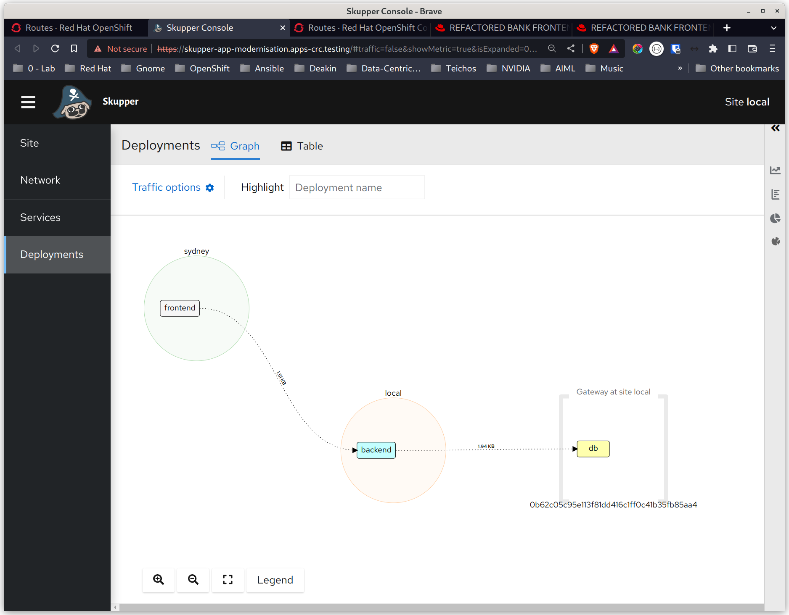

# Partially Migrate the Application Backend to Cloud

In this demonstration we will deploy the backend onto OpenShift on-premises, and decommission the backend application running on the VM.

## High-Level Steps:
1. Deploy the backend to OpenShift
2. Expose the database as a service to the on-premises and Sydney clusters
3. Remove the backend from the Gateway
4. Expose the backend's Deployment to the RHAI network

## Steps

1. Deploy the backend
   ```
   ONPREM: jboss-breakdown-monolith$ oc apply -f ./yaml/backend.yaml 
   Warning: would violate PodSecurity "restricted:v1.24": allowPrivilegeEscalation != false (container "backend" must set securityContext.allowPrivilegeEscalation=false), unrestricted capabilities (container "backend" must set securityContext.capabilities.drop=["ALL"]), runAsNonRoot != true (pod or container "backend" must set securityContext.runAsNonRoot=true), seccompProfile (pod or container "backend" must set securityContext.seccompProfile.type to "RuntimeDefault" or "Localhost")
   deployment.apps/backend created
   ONPREM: jboss-breakdown-monolith$ 
   ```

2. Expose the database to the network  
We need to make the database visible to the application on OpenShift as a local service.  
Note: In a real life scenario this would probably be resolved via DNS and an unessary step.  
```skupper gateway expose db 127.0.0.1 5432 --type podman```
RHAI creates a service proxy in the service network.

3. Open the RHAI Console and show the new service in the Gateway.

4. Remove the backend from the gateway.  
Unexpose the Backend:  
```skupper gateway unexpose backend```  
Unbind the Backend:  
  ```skupper gateway unbind backend```  
**Note:** Sometimes these two commands cause the Gateway to die. If that happens just re-run this command: ```skupper gateway expose db 127.0.0.1 5432 --type podman```  

4. Expose the backend to the RHAI network:  
   ```skupper expose deployment backend --port 8080```  
   **Note:** You need to wait a few seconds for RHAI to propagate the updated network information.

5. Demonstrate the application working  

6. Open the RHAI Console and demonstrate the new application topology and review how the wqhole progressive approach was enabled by RHAI. 
