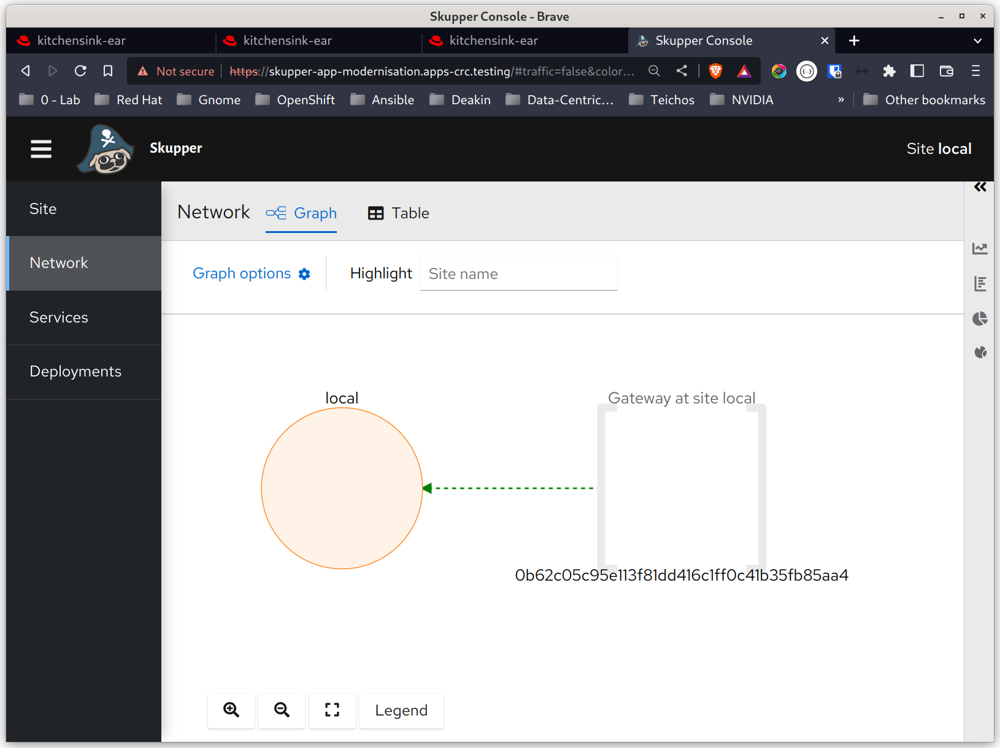
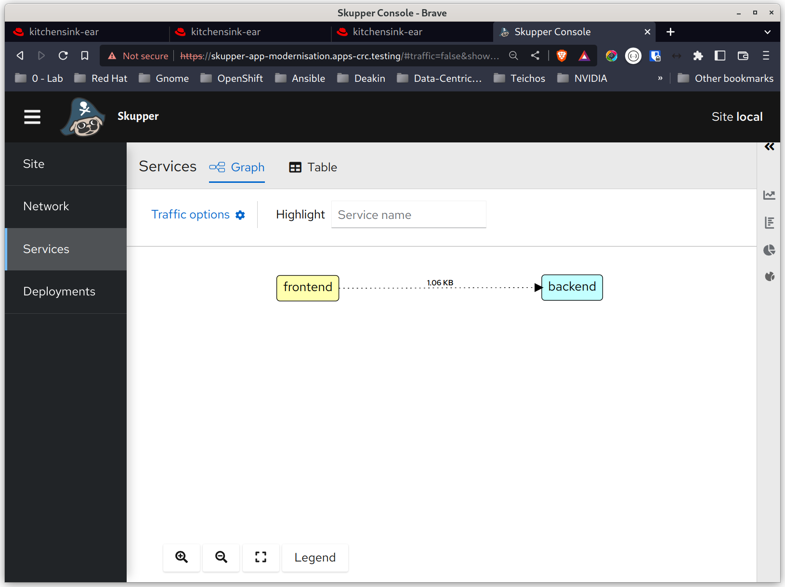
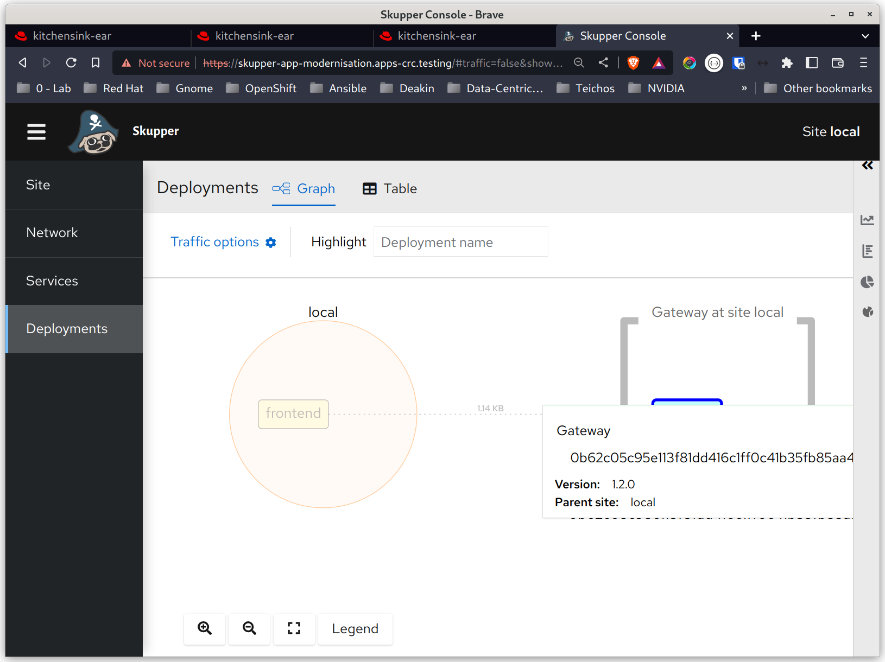

# Move the Front End to OpenShift On-Premises

This demo script shows how to launch the Refactored monolith and deploy the frontend on the on-premises OpenShift.  

Note: This demonstration works with both Docker and Podman. The steps in these instructions will refer to Podman. Simply replace ```podman``` for ```docker``` and the commands remain the same.

## Environment Summary

This demonstration has been tested using:
1. macOS ```<insert version number>``` and Fedora Linux 36.
2. Docker or Podman to run the "on-premises" database and monolithic backend.
3. OpenShift Local to run the frontend.
4. Application Interconnect (Skupper) to provide the connectivity between the frontend and the monolith running in a container.

## High-Level Summary of Demonstration

1. Install RHAI.
2. Start OpenShift Local
3. Start the database and Backend components
4. Set up the OpenShift Project Environment
5. Install RHAI in the namespace
6. Create an RHAI Gateway to expose the Backend to the Frontend's namespace.
7. Deploy the Frontend to OpenShift
8. Demonstrate the Appication
9. Examine the RHAI network in the Admin COnsole

## Demo Script

### Preconditions:
1. The demo repository (https://github.com/bfarr-rh/jboss-breakdown-monolith) has been cloned to the demonstration machine.
2. You have the latest contgainer images for the demonstration:
   ```
   $ podman pull quay.io/bfarr/jboss-demo-frontend
   $ podman pull quay.io/bfarr/jboss-demo-backend
   $ podman pull docker.io/library/postgress:latest
    ```  
**TODO:** Change this for Postgress from Red Hat Congtainer Catalog.

**Note:** Unless specifically described otherwise, all commands in this script are relative to the root directory of the Git repository.

### Install Red Hat Application Interconnect (Skupper)

1. Download and install RHAI using the instructions located at: https://skupper.io/releases/index.html

### Start OpenShift Local

1. Open a new terminal window and start OpenSHift Local:  
```crc start```

### Start the Database and Backend Application

1. Ensure a clean container environment by deleting all running containers:  
```podman kill --all```  
The system stops all running containers.
    ```
    $ podman kill --all
    7290f08ad7572a37fec8c2538ee0f43b98d115e9105bac2fec79e83d671d277b
    a68ccebf827af96b227c9bdd79c1e75cb652693113dd6ee30d7ca1cb058a78f6
    c462586b7101af6b430ae287e055eb53f0bc85b0bb58143823df73642d49887e
    ```


2. Start the containers used in this demonstration:  
   ```./tools/start-all.sh```  
   The system starts the database, backend, and refactored frontend containers.  

   **Note:** While the Frontend is not necessary for this demonstration, having it running as a container is a useful way to shake out the backend and database to make sure they are working.

   ```
   $ ./tools/start-all.sh 
   Checking for container runtime...
   Podman is installed
   5d2724f6f3d2c9cdd1c7f733eef23132b12e3751e9304b5e55d33fcd6e5cd0ce
   1d16a407b2b9a56e7fc82d768abe4f00bd89a7661f89ff187839f0961b346541
   1ab6ba81df4e5ffee7d5fb312c6a15cb10f9738ce6488d080eb71e86ab45b0f6
    ```

3. Test the environment is up and running.  
   Open a browser and navigate to the following url: http://localhost:8180/rbank  
   The system will display the app's main screen 
     

   Test the app by creating a booking and then view the queue by clicking **View Queue.**

### Set up the OpenShift Project Environment

1. Open a new Terminal window and change into the project directory.  
2. Set up the On-Premises OpenShift environment:  
   ```. ./tools/setup-onprem-k8s-env.sh```  
   The system will create a new shell and isolated Kubernetes environment for you to work in.  
   ```
   $ . ./tools/setup-onprem-k8s-env.sh 
   Setting up isolated Kubernetes environment in: /home/username/.kube/app-modernisation-onprem

   ONPREM: jboss-breakdown-monolith$ 
   ```  
   The system sets up a new Kubernetes environment and updates the system prompt to indicate which environment you  are working in. **Pay special attention to this prompt** as you start working with multiple clusters. This prompt tells you which cluster you are working in.

3. Log on to the ONPREM cluster:  
   ```oc login -u developer  https://api.crc.testing:6443 ```
   Note: Substitute the username ```developer``` for the username you are using.

4. Create a project for the demonstration  
   ```oc new-project app-modernisation```  
   The system creates a new OpenShift project

   ```
   $ oc login -u developer https://api.crc.testing:6443 
   Logged into "https://api.crc.testing:6443" as "developer" using existing credentials.

   You have access to the following projects and can switch between them with 'oc project <projectname>':

     * default

   Using project "default".
   ```

5. Create the project for the demonstration:  
   ```oc new-project app-modernisation```

   The system crete a new project for the demonstration:
   ```
   $ oc new-project app-modernisation
   Now using project "app-modernisation" on server "https://api.crc.testing:6443".

   You can add applications to this project with the 'new-app' command. For example, try:

       oc new-app rails-postgresql-example

   to build a new example application in Ruby. Or use kubectl to deploy a simple Kubernetes application:

       kubectl create deployment hello-node --image=k8s.gcr.io/e2e-test-images/agnhost:2.33 -- /agnhost serve-hostname

   ```

### Install RHAI into the OpenShift project

1. Install RHAI into the project:  
```skupper init --site-name local --console-auth=internal --console-user=admin --console-password=password```

The system installes RHAI and assignes the username and password for the administrator console.

2. Check the install status of RHAI. Wait until all pods are Running:  
```watch oc get svc,pods```

   ```
   Every 2.0s: oc get svc,pods                                                       rh-brbaker: Fri Nov 25 15:36:10 2022

   NAME                           TYPE        CLUSTER-IP     EXTERNAL-IP   PORT(S)               AGE
   service/skupper                ClusterIP   10.217.4.49    <none>        8080/TCP,8081/TCP     44s
   service/skupper-router         ClusterIP   10.217.5.159   <none>        55671/TCP,45671/TCP   46s
   service/skupper-router-local   ClusterIP   10.217.4.111   <none>        5671/TCP              46s

   NAME                                            READY   STATUS    RESTARTS   AGE
   pod/skupper-router-f85775498-n2ddd              2/2     Running   0          46s
   pod/skupper-service-controller-55876c99-9m8mr   1/1     Running   0          44s
   ```

### Create an RHAI Gateway to expose the Backend

This section will create a Gateway on the same machine that the Backend is running. The Gateway will be configured to expose the Backend application as one or more services on OpenShift.

1. Install the Gateway   
   ```skupper gateway expose backend 127.0.0.1 8080 --type podman```

   ```
   $ skupper gateway expose backend 127.0.0.1 8080 --type podman
   2022/11/25 15:41:15 CREATE io.skupper.router.tcpConnector rh-brbaker-bryon-egress-backend:8080 map[address:backend:8080 host:127.0.0.1 name:rh-brbaker-bryon-egress-backend:8080 port:8080 siteId:ed553929-9e58-484e-9a9a-898fcf7c3e51
   ```

   The system installs the Gateway and publishes the backend as a service on OpenShift.

2. Get the services and pods running on OpenShift:  
   ```oc get svc,pods```  

   ```
   $ oc get svc,pods
   NAME                           TYPE        CLUSTER-IP     EXTERNAL-IP   PORT(S)               AGE
   service/backend                ClusterIP   10.217.4.236   <none>        8080/TCP              106s
   service/skupper                ClusterIP   10.217.4.49    <none>        8080/TCP,8081/TCP     7m26s
   service/skupper-router         ClusterIP   10.217.5.159   <none>        55671/TCP,45671/TCP   7m28s
   service/skupper-router-local   ClusterIP   10.217.4.111   <none>        5671/TCP              7m28s

   NAME                                            READY   STATUS    RESTARTS   AGE
   pod/skupper-router-f85775498-n2ddd              2/2     Running   0          7m28s
   pod/skupper-service-controller-55876c99-9m8mr   1/1     Running   0          7m26s
   ```

   Observe that the backend is available as a service, but there are no pods running for it.

3. View the backend service's configuration
   ```oc get svc/backend -o yaml```

   ```
   $ oc get svc/backend -o yaml
    apiVersion: v1
    kind: Service
    metadata:
    annotations:
        internal.skupper.io/controlled: "true"
    creationTimestamp: "2022-11-25T04:41:06Z"
    labels:
        internal.skupper.io/gateway: rh-brbaker-bryon
    name: backend
    namespace: app-modernisation
    ownerReferences:
    - apiVersion: apps/v1
        kind: Deployment
        name: skupper-router
        uid: 0d8fe133-01df-43cb-8db9-9af957d63725
    resourceVersion: "60483"
    uid: c3587027-a78b-4532-9632-9285855e5a40
    spec:
    clusterIP: 10.217.4.236
    clusterIPs:
    - 10.217.4.236
    internalTrafficPolicy: Cluster
    ipFamilies:
    - IPv4
    ipFamilyPolicy: SingleStack
    ports:
    - name: port8080
        port: 8080
        protocol: TCP
        targetPort: 1024
    selector:
        application: skupper-router
        skupper.io/component: router
    sessionAffinity: None
    type: ClusterIP
    status:
    loadBalancer: {}
   ```
   Observe the ```annotations``` and the ```selector``` attributes are pointing the service to the RHAI router. This is what enables RHAI to intercept calls to the service and send them out over the router.

4. View the RHAI Network Status  
   ```skupper network status```  

   ```
   $ skupper network status
    Sites:
    ╰─ [local] 6d18150 - local 
    mode: interior
    name: local
    namespace: app-modernisation
    version: 1.2.0
    ╰─ Services:
        ╰─ name: backend
            address: backend: 8080
            protocol: tcp
   ```

   Thwe system displays the services that have been published in OpenShift to the RHAI mesh network, and the port they are accessed via.

5. View the RHAI Gateway status
   ```skupper gateway status```

   ```
   $ skupper gateway status
     Gateway Definition:
     ╰─ rh-brbaker-bryon type:podman  
     version:2.2.0
     ╰─ Bindings:
        ╰─ backend:8080 tcp backend:8080 127.0.0.1 8080
   ```
   The system shows how the backend service is bound to an ip address and port on the virtual machine.

### Deploy the Frontend to OpenShift
1. Deploy the Frontend to OpenShift on premises
   ```oc apply -f ./yaml/frontend.yaml```  
   **Note:** Ignore any Warning regarding violation of PodSecurity.
   ```
   $ oc apply -f ./yaml/frontend.yaml 

   deployment.apps/frontend created
   service/frontend created
   route.route.openshift.io/frontend created
   ```

### Demonstrate the Appication
1. Find the route to the Frontend  
   ```oc get routes```

   ```
   $ oc get route/frontend
   NAME       HOST/PORT                                     PATH   SERVICES   PORT   TERMINATION   WILDCARD
   frontend   frontend-app-modernisation.apps-crc.testing          frontend   8080                 None
   ```

2. Copy the url to the Clipboard
   ```frontend-app-modernisation.apps-crc.testing```

3. Open a browser and paste the url into the address box. Append the following to the url and press **Enter**: ```/rbank```
   ```http://frontend-app-modernisation.apps-crc.testing/rbank```

   The system displays the main App window.  
     

4. Create a booking and test the data is persisted.

### Examine the RHAI Network in the Admin Console

1. Find the url for the admin Console:
   ```oc get route/skupper```

   ```
   $ oc get route/skupper
   NAME      HOST/PORT                                    PATH   SERVICES   PORT      TERMINATION          WILDCARD
   skupper   skupper-app-modernisation.apps-crc.testing          skupper    metrics   reencrypt/Redirect   None
   ```

2. Open a new tab on a Browser and paste the route into the address box of your Browser.  
   RHAI prompts you for the username and password.

3. Enter a username/password of ```admin/password```
   RHAI displays the admin console.

4. Browse the different perspectives to view the services and topology:

  
  
  